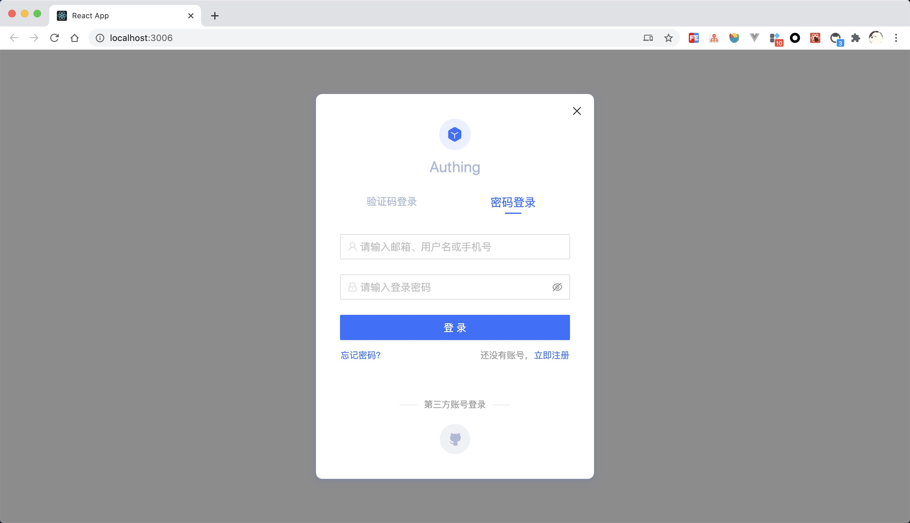

# Authing UI Components

  
  
  
  
  

 

[Authing](https://authing.cn) 是一个企业级身份认证提供商，其集成了 OAuth、LDAP、OIDC 等多种身份认证和授权解决方案。此仓库包含了 Authing 提供的一些 UI 组件。

## 生态周边

|包名|版本|使用文档
|-----|----|----|
|@authing/react-ui-components||[Authing React UI Components](https://docs.authing.cn/v2/reference/ui-components/react.html)|
|@authing/vue-ui-components||[Authing Vue UI Components](https://docs.authing.cn/v2/reference/ui-components/vue.html)|
|@authing/ng-ui-components||[Authing Angular UI Components](https://docs.authing.cn/v2/reference/ui-components/angular.html)|
|@authing/native-js-ui-components||[Authing Native JavaScript UI Components](https://docs.authing.cn/v2/reference/ui-components/native-javascript.html)|

## 登录组件（Guard）

Authing 登录组件（Guard）是一种可嵌入的登录表单，可根据你的需求进行配置，建议用于单页面应用程序。它使你可以轻松添加各种社会化登录方式，以便你的用户可以无缝登录，并且在不同平台拥有一致的登录体验。Guard 为开发者屏蔽了很多底层认证的实现细节，同时也包括繁琐的 UI 开发。

Guard 可以集成到你的 React、Vue.js、Angular 以及原生 JavaScript 项目中，你可以借助此组件快速实现登录认证流程。

## 功能列表

#### 丰富的登录注册方式

内置丰富的登录注册方式供开发者选择：

- 账号密码登录（包括手机号 + 密码、邮箱 + 密码、用户名 + 密码）；
- 手机验证码登录；
- APP 扫码登录（[需先接入 APP 扫码登录](https://docs.authing.cn/v2/guides/authentication/qrcode/use-self-build-app/)）；
- 小程序扫码登录（[需先在后台配置](https://docs.authing.cn/v2/guides/authentication/qrcode/use-wechat-miniprogram/)）；
- 社会化登录，如 Github 登录（[需先在后台配置](https://docs.authing.cn/v2/guides/connections/social.html)）；
- 企业身份源登录（[需要配置企业身份源](https://docs.authing.cn/v2/guides/connections/enterprise.html)）；

#### 内置忘记密码流程

Guard 内置了忘记密码的交互 UI，你无需编写任何额外代码。

#### 内置多因素认证（MFA）能力

Guard 内置了多因素认证（MFA）功能，当你的[应用开启了多因素认证](https://docs.authing.cn/v2/guides/app/mfa.html)之后，用户可以使用该组件完成多因素认证。你无需编写任何额外代码。

#### 响应式布局

响应式布局，完美兼容移动端和 PC 端，同时你可以通过自定义 CSS 轻易地自定义登录框样式。

#### 兼容前端所有主流框架

- [原生 JavaScript 调用](https://docs.authing.cn/v2/reference/ui-components/native-javascript.html)；
- [Vue 组件](https://docs.authing.cn/v2/reference/ui-components/vue.html)；
- [React 组件](https://docs.authing.cn/v2/reference/ui-components/react.html)；
- [Angular 组件](https://docs.authing.cn/v2/reference/ui-components/angular.html)。

### 在线示例

<iframe src="https://codesandbox.io/embed/red-microservice-6613h?fontsize=14&hidenavigation=1&theme=dark"
     style="width:100%; height:500px; border:0; border-radius: 4px; overflow:hidden;"
     title="authing-react-guard"
     allow="accelerometer; ambient-light-sensor; camera; encrypted-media; geolocation; gyroscope; hid; microphone; midi; payment; usb; vr; xr-spatial-tracking"
     sandbox="allow-forms allow-modals allow-popups allow-presentation allow-same-origin allow-scripts"
   ></iframe>

## 参与贡献

- Fork it
- Create your feature branch (git checkout -b my-new-feature)
- Commit your changes (git commit -am 'Add some feature')
- Push to the branch (git push origin my-new-feature)
- Create new Pull Request

## 获取帮助

Join us on forum: [#authing-chat](https://forum.authing.cn/)

详细使用文档请查看 [Guard for Web](https://docs.authing.cn/v2/reference/ui-components/)

## LICENSE

MIT
